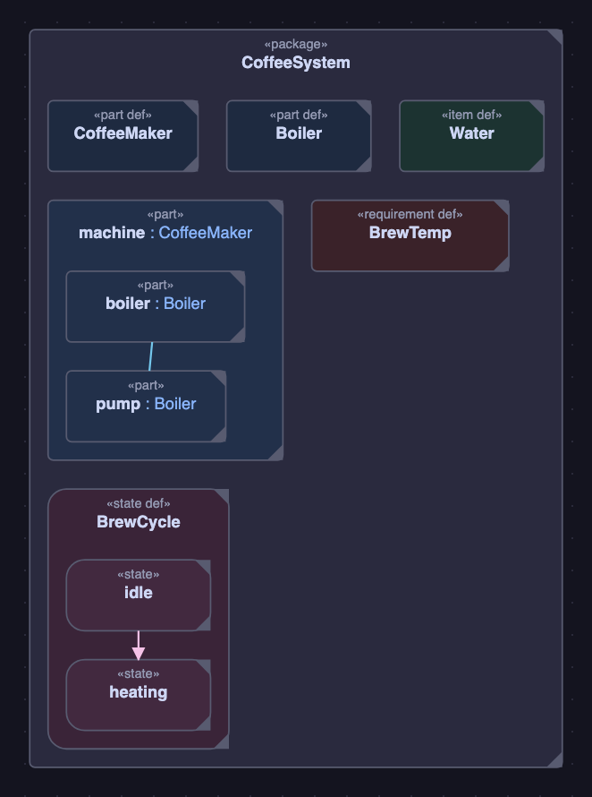
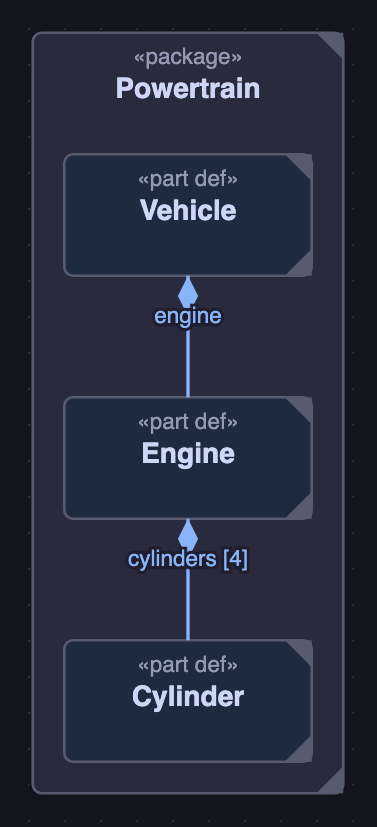
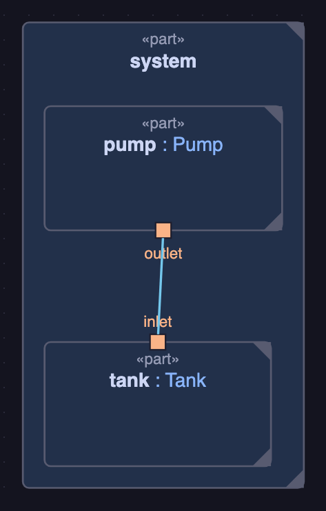
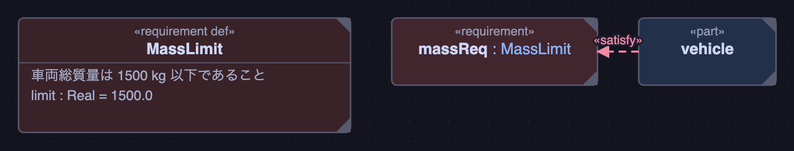
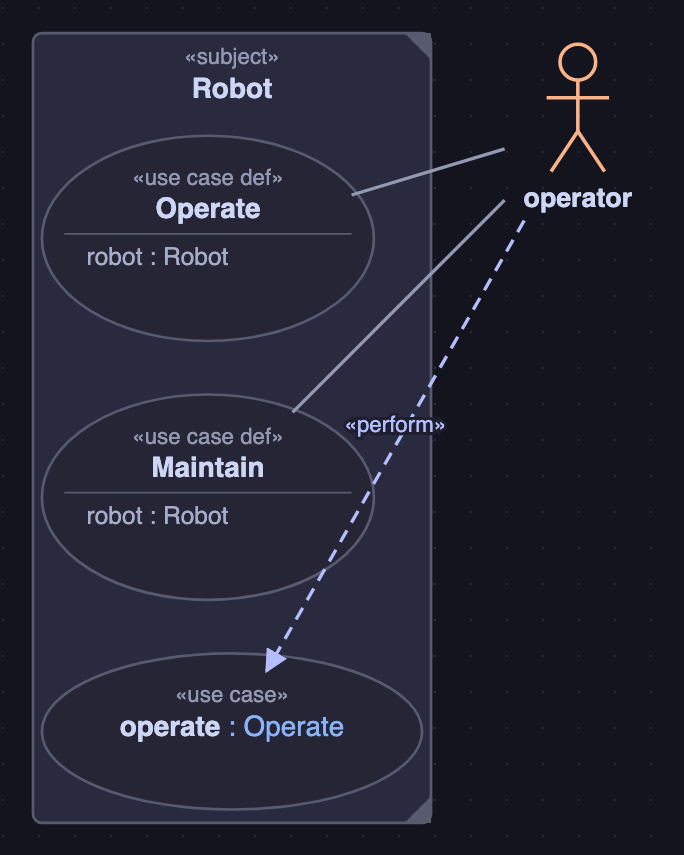
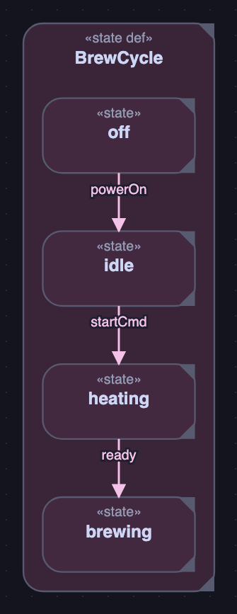
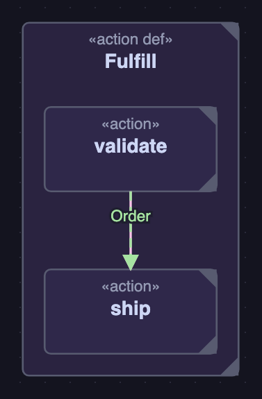

<div align="center">

# SysML v2 Studio

**在 VS Code 中编写、查看和编辑 SysML v2(`.sysml` / `.kerml`)**

[](https://marketplace.visualstudio.com/items?itemName=engineer-fumi.sysml-v2-studio)
[](https://marketplace.visualstudio.com/items?itemName=engineer-fumi.sysml-v2-studio)
[](https://www.npmjs.com/package/@engineer-fumi/sysml-v2-mcp)
[](LICENSE)

[English](README.md) · [日本語](README.ja.md) · **简体中文**

一个 SysML v2 扩展,提供完整的语言支持(高亮、诊断、补全、跳转到定义),
并具备 **8 种可编辑的图**和 **Claude (MCP) 集成**。



</div>

## 特性

- 🎨 **8 种图** — 总览图 / 模块定义图 (BDD) / 内部模块图 (IBD) / 需求图 / 用例图 / 状态图 / 活动图 / 时序图
- ✏️ **直接从图中编辑** — 移动、缩放、连接、重命名和删除,全部**回写到文本**(手动布局保存到附属文件)
- 🔎 **语言支持** — 语法高亮、实时诊断(语法 + 语义)、补全、大纲、跨文件跳转到定义与悬停
- 🔗 **双向同步** — 点击图元 ⇄ 跳转到源代码,编辑器光标 ⇄ 在图中高亮
- 🤖 **Claude (MCP) 集成** — 将模型**作为结构**进行解析、校验和查询(Claude Code / Desktop / VS Code AI)
- 📦 **多文件 / 远程支持**(Remote-SSH / WSL / Dev Containers),📚 **内置标准库** + **OMG 官方示例**

## 安装

在 VS Code Marketplace 中搜索 **“SysML v2 Studio”** 并安装,或:

```bash
code --install-extension engineer-fumi.sysml-v2-studio
```

> 需要 VS Code **1.101 或更高版本**。如需从源码构建 `.vsix`,请参阅
> [开发指南](docs/development.md)。

## 快速开始 — 预览图

1. **打开一个 `.sysml` / `.kerml` 文件**(内置的 `samples/` 是最简单的起点)
2. 点击编辑器右上角的**图标按钮**,或在命令面板运行
   **“SysML: Open Diagram”**
   → 图会在编辑器旁边预览显示
3. 通过面板顶部的选择器,或 **“SysML: Open Diagram by Kind”** 在 8 种图之间切换
4. **拖动**方块进行布局,**右键**进行连接 / 修改线型 / 删除
   → 修改会**自动回写到源文本**(布局保存到 `.sysml-layout.json`)

点击图中的元素可跳转到对应的源代码行;编辑器的光标位置也会在图中高亮显示。

## Claude (MCP) 集成

扩展内置了一个**独立的 MCP 服务器**,让 Claude 等 AI 能够将你的 `.sysml` 模型
**作为结构而非纯文本**来处理 — 以工具形式提供解析、校验、需求列举和图结构查询。

**根据你使用的客户端,执行下面两种操作之一。**

### ① 使用 VS Code 的 AI(Copilot / agent)→ 无需配置

只要你在 VS Code **1.101 或更高版本**上安装了本扩展,就**无需任何操作**。
扩展会自动注册 MCP 服务器。在命令面板打开 **“MCP: List Servers”**,
如果列表中有 **“SysML v2 Studio”**,即表示已生效。

### ② 使用 Claude Code / Claude Desktop → 一行注册

对于 **Claude Code**(独立于 VS Code 的客户端),在项目根目录运行一次以下命令
(使用 `npx`,无需预先安装):

```bash
claude mcp add sysml -- npx -y @engineer-fumi/sysml-v2-mcp "$(pwd)"
```

对于 **Claude Desktop**,在配置文件中加入:

```jsonc
{ "mcpServers": { "sysml": {
  "command": "npx",
  "args": ["-y", "@engineer-fumi/sysml-v2-mcp", "<模型文件夹的绝对路径>"]
} } }
```

提供的工具:`list_files` / `outline` / `validate` / `find_element` /
`list_requirements` / `describe_diagram`。注册方式的变体(指定路径、自行构建)、
工具详情和用例,请参阅 [Claude (MCP) 集成指南](docs/mcp.md)。

## 记法与图的对应

同一份文本模型会根据所选图的种类以不同方式绘制。以下是每种图的**最小示例及其
实际渲染结果**(上方的总览大图也以同样方式生成)。

### 模块定义图 (BDD) — 定义的结构、组合、特化

```sysml
package Powertrain {
  part def Vehicle;
  part def Engine;
  part def Cylinder;
  part v : Vehicle { part engine : Engine; }
  part e : Engine { part cylinders : Cylinder[4]; }
}
```



### 内部模块图 (IBD) — part 内部的连接(port / connect)

```sysml
package Hydraulics {
  port def FluidPort;
  part def Pump { port outlet : FluidPort; }
  part def Tank { port inlet : FluidPort; }
  part system {
    part pump : Pump;
    part tank : Tank;
    connect pump.outlet to tank.inlet;
  }
}
```



### 需求图 — 需求与 satisfy 关系

```sysml
package Requirements {
  requirement def MassLimit {
    doc /* 車両総質量は 1500 kg 以下であること */ // "车辆总质量应不超过 1500 kg"
    attribute limit : Real = 1500.0;
  }
  requirement massReq : MassLimit;
  part vehicle;
  satisfy massReq by vehicle;
}
```



### 用例图 — 用例与执行者、perform

```sysml
package Robot {
  part def Operator;
  use case def Operate { subject robot : Robot; actor operator : Operator; }
  use case def Maintain { subject robot : Robot; actor operator : Operator; }
  use case operate : Operate;
  part operator : Operator { perform operate; }
}
```



### 状态图 — 状态与 transition(带 trigger)

```sysml
package Machine {
  state def BrewCycle {
    state off;
    state idle;
    state heating;
    state brewing;
    transition first off accept powerOn then idle;
    transition first idle accept startCmd then heating;
    transition first heating accept ready then brewing;
  }
}
```



### 活动图 — 动作与 succession / item flow

```sysml
package Process {
  item def Order;
  action def Fulfill {
    action validate;
    action ship;
    first validate then ship;
    flow of Order from validate to ship;
  }
}
```



> 图的种类、编辑操作和布局保存的详细说明,请参阅 [图功能指南](docs/diagrams.md)。

## SysML v2 支持范围

本扩展实现了 OMG SysML v2 文本记法的**实用子集**(基于代码审计的概览;
详情与依据请参阅[支持范围 (conformance matrix)](docs/conformance.md))。

| 语言领域 | 支持级别 |
|---|---|
| Definitions & Usages(part / item / attribute / port / action / state …) | **Full** |
| Specialization(`:>` / `:>>` / `specializes` / `subsets` / `redefines`) | **Full** |
| Connections / Interfaces / Bindings / Flows | **Full**(结构) |
| Requirements / Constraints / satisfy・verify | **Full**(结构)/ 表达式 AST+类型检查 |
| Use Cases / Actors / include・perform | **Full** |
| Metadata / Annotations(`@`、`#`、`metadata def`) | **Full**(解析) |
| Comments / Documentation(`//`、`/* */`、`doc`、`comment`) | **Full** |
| States & Transitions / Actions / Calc | **Partial**(trigger/guard/effect 与控制流不透明) |
| Views / Viewpoints / Rendering | **Partial**(渲染未实现) |
| Imports / Aliases / Visibility | **Partial**(private/protected 未强制) |
| Expressions(值与 constraint / calc 主体) | **Partial**(结构化 AST+仅正向知识的类型检查,不求值) |
| Standard Library | **内置最小子集**(非完整的 OMG 库) |
| KerML 基础层(classifier / feature / function …) | **Parse-only** |

> 级别定义(Full / Partial / Parse-only / None)以及各领域的依据,
> 记载于 [conformance matrix](docs/conformance.md)。

## 文档

- [图功能详解](docs/diagrams.md) — 图的种类、编辑操作、布局保存
- [支持的记法与限制](docs/syntax.md) — 所支持的 SysML v2 子集
- [支持范围 (conformance matrix)](docs/conformance.md) — 语言领域 × 支持级别的详细表
- [Claude (MCP) 集成指南](docs/mcp.md) — MCP 服务器的注册、工具、用例
- [开发指南](docs/development.md) — 架构、构建、测试、发布

> 文档页面目前以日语编写。

## 许可证

[MIT](LICENSE)。`samples/omg/` 下的 OMG 官方示例为 EPL-2.0
([详情](samples/omg/README.md))。内置的第三方组件(React 等)
请参阅 [THIRD-PARTY-NOTICES.txt](THIRD-PARTY-NOTICES.txt)。
